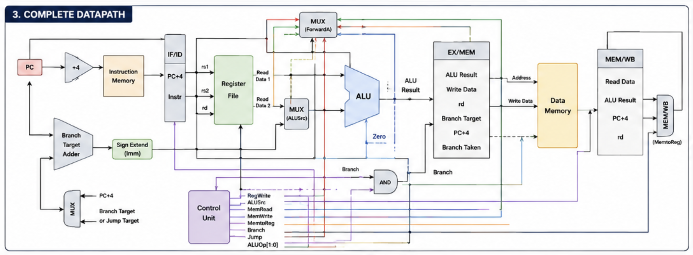
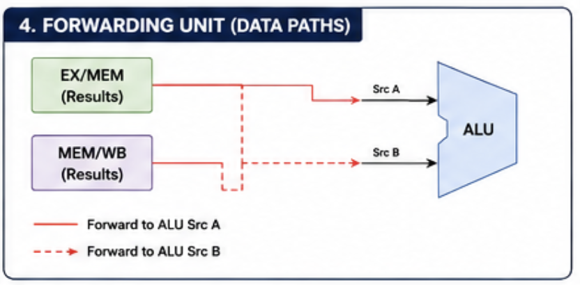
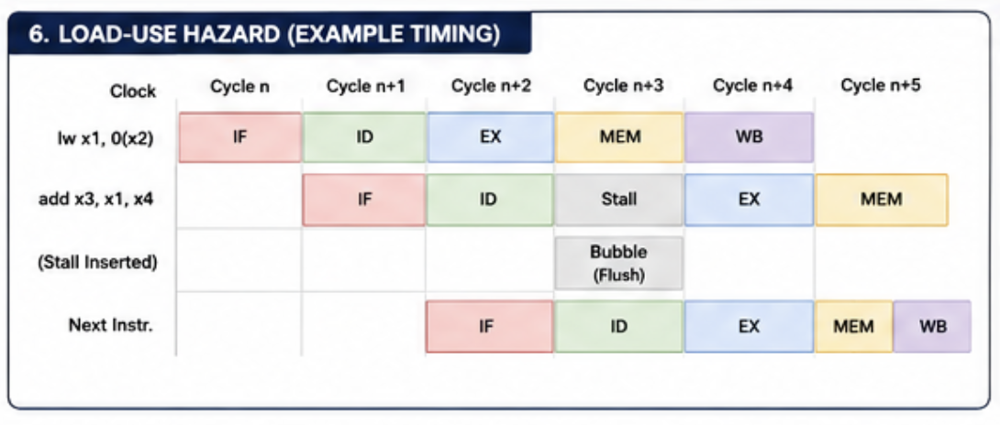
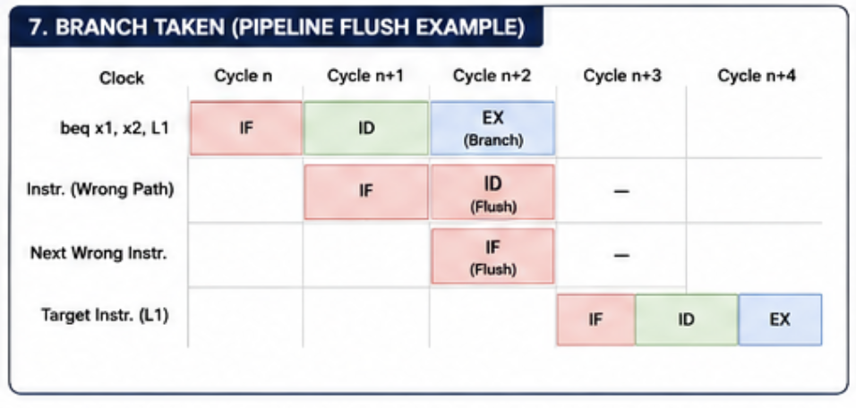

# RV32I 5-Stage Pipelined RISC-V Processor

<p align="center">
  <b>A 32-bit pipelined RISC-V processor implemented in Verilog HDL featuring hazard detection, forwarding, branch handling, and a modular RTL architecture.</b>
</p>

<p align="center">


</p>

---

# Architecture

<p align="center">
  
</p>

<p align="center">
<b>Figure 1.</b> CPU ARCHITECTURE
</p>

The processor follows the classical **five-stage RISC-V pipeline**, separating execution into independent stages to improve throughput while maintaining correctness through hazard detection and forwarding.

Pipeline Stages:

- Instruction Fetch (IF)
- Instruction Decode (ID)
- Execute (EX)
- Memory Access (MEM)
- Write Back (WB)

---

# Features

- 32-bit RV32I Processor
- Five-stage pipelined architecture
- Modular RTL implementation
- Hazard Detection Unit
- Data Forwarding Unit
- Branch & Jump Handling
- Pipeline Flush Logic
- Immediate Generator
- Register File
- Separate Instruction & Data Memory
- ALU Control Unit
- Verified using Icarus Verilog
- Waveform analysis using GTKWave

---

# Pipeline Overview

<p align="center">
  
</p>

<p align="center">
<b>Figure 1.</b> 5 STAGE PIPELINE
</p>

| Stage | Description |
|--------|-------------|
| IF | Fetch instruction from Instruction Memory |
| ID | Decode instruction, register read, immediate generation |
| EX | ALU execution, branch evaluation, forwarding |
| MEM | Data memory read/write |
| WB | Register write back |

---

# Processor Datapath

<p align="center">
  
</p>

<p align="center">
<b>Figure 1.</b> Complete RV32I Processor Datapath
</p>
```

The datapath consists of:

- Program Counter
- Instruction Memory
- Register File
- Immediate Generator
- ALU
- Data Memory
- Pipeline Registers
- Control Unit
- Hazard Detection Unit
- Forwarding Unit

---

# Hazard Handling

## Data Forwarding

<p align="center">
  
</p>

<p align="center">
<b>Figure 1.</b> FORWARDING UNIT
</p>

The forwarding unit resolves RAW (Read After Write) hazards without stalling the pipeline whenever possible.

Forwarding sources:

- EX/MEM
- MEM/WB

Supported forwarding:

- EX Forwarding
- MEM Forwarding
- Store Data Forwarding

---

## Load-Use Hazard Detection

<p align="center">
  
</p>

<p align="center">
<b>Figure 1.</b> LOAD USE HAZARD
</p>

When a load instruction is immediately followed by an instruction requiring the loaded value, the Hazard Detection Unit:

- Stalls the Program Counter
- Stalls the IF/ID register
- Inserts a bubble into the ID/EX register

This prevents incorrect execution while minimizing pipeline stalls.

---

## Branch Handling

<p align="center">
  
</p>

<p align="center">
<b>Figure 1.</b> BRANCH TAKEN
</p>

Branch instructions are resolved in the Execute stage.

When a branch is taken:

- Incorrectly fetched instructions are flushed.
- The Program Counter is redirected to the branch target.

---

# Supported Instructions

| Category | Instructions |
|-----------|--------------|
| Arithmetic | ADD, SUB, ADDI |
| Logical | AND, OR, XOR |
| Shift | SLL, SRL |
| Comparison | SLT |
| Memory | LW, SW |
| Branch | BEQ |
| Jump | JAL |

---

# Project Structure

```text
RV32I/
│
├── rtl/
│   ├── cpu_pipeline.v
│   ├── alu.v
│   ├── alu_control.v
│   ├── control_unit.v
│   ├── forwarding_unit.v
│   ├── hazard_detection_unit.v
│   ├── register_file.v
│   ├── instruction_memory.v
│   ├── data_memory.v
│   ├── immediate_generator.v
│   ├── id_stage.v
│   ├── ex_stage.v
│   ├── mem_stage.v
│   ├── wb_stage.v
│   ├── if_id_register.v
│   ├── id_ex_register.v
│   ├── ex_mem_register.v
│   └── mem_wb_register.v
│
├── testbench/
│
├── docs/
│
├── diagrams/
│
├── scripts/
│
├── synthesis/
│
├── timing/
│
├── README.md
│
└── LICENSE
```

---

# Verification

The processor has been verified through simulation using directed test cases.

| Feature | Status |
|----------|:------:|
| Arithmetic Operations | ✅ |
| Logical Operations | ✅ |
| Shift Operations | ✅ |
| Memory Read | ✅ |
| Memory Write | ✅ |
| Branch Execution | ✅ |
| Jump Execution | ✅ |
| Register Writeback | ✅ |
| EX Forwarding | ✅ |
| MEM Forwarding | ✅ |
| Store Forwarding | ✅ |
| Load-Use Hazard Detection | ✅ |
| Pipeline Flush | ✅ |

---

# Simulation

Compile:

```bash
iverilog -g2012 -Wall -o cpu_pipeline_tb.out rtl/*.v testbench/cpu_pipeline_tb.v
```

Run:

```bash
vvp cpu_pipeline_tb.out
```

View waveform:

```bash
gtkwave pipeline.vcd
```

---

# Simulation Results

> **📷 INSERT GTKWAVE SCREENSHOT HERE**

```
simulation.png
```

Example register output:

```text
x1 = 5
x2 = 10
x3 = 10
x4 = 10
x5 = 10
x6 = 0
x7 = 99
```

---

# Design Highlights

- Modular RTL architecture
- Clean separation of datapath and control logic
- Classical five-stage pipeline
- Forwarding to reduce pipeline stalls
- Hazard detection for load-use dependencies
- Branch flush mechanism
- Parameterized and reusable modules
- Simulation-driven verification

---

# Future Enhancements

- Full RV32I ISA support
- JALR instruction
- AUIPC instruction
- Additional branch instructions
- Branch prediction
- Instruction cache
- Data cache
- AXI-Lite interface
- UART peripheral
- FPGA implementation

---

# Tools Used

| Tool | Purpose |
|------|----------|
| Verilog HDL | RTL Design |
| Icarus Verilog | Simulation |
| GTKWave | Waveform Analysis |
| VS Code | Development |
| Git & GitHub | Version Control |

---

# References

- RISC-V Unprivileged ISA Specification
- Patterson & Hennessy — *Computer Organization and Design*
- Icarus Verilog Documentation
- GTKWave Documentation

---

# License

This project is licensed under the MIT License.

---

<p align="center">
Designed and implemented as an educational RTL project demonstrating pipelined RISC-V processor design, hazard resolution, and modular hardware architecture in Verilog HDL.
</p>
